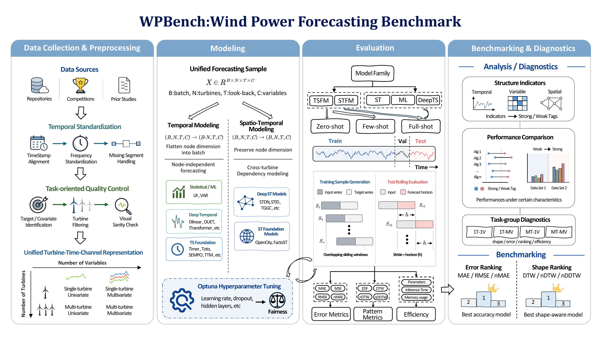

# WPBench: A Comprehensive Benchmark for Wind Power Forecasting

WPBench benchmarks 19 forecasting models on 26 public wind-power datasets.
This repository provides fixed-parameter scripts for the paper's main results
and foundation-model adaptation experiments.

[](docs/figures/wpbench_overview.pdf)

## Quickstart

Run the following commands from the repository root.

### 1. Environment

The DLinear example below was checked with Python 3.11.15 and PyTorch 2.10.0
(CUDA 12.8).

```bash
conda env create -n wpbench -f environment/wpbench_unified_hpo.yml
conda activate wpbench
```

### 2. Datasets

Download the [26-dataset bundle](https://drive.google.com/drive/folders/1j8siMZ-SG6Q2yrfC0hPeAjG28fqImCib?usp=sharing)
and restore the CSV files and metadata:

```bash
mkdir -p dataset/forecasting/forecasting_wp1_all_shapes_v1
cp -a /path/to/wpbench_26_bundle_20260611/forecasting_wpbench_26/*.csv \
  dataset/forecasting/forecasting_wp1_all_shapes_v1/
cp /path/to/wpbench_26_bundle_20260611/metadata/FORECAST_META.csv \
  dataset/forecasting/FORECAST_META.csv
```

Keep the supplied CSV filenames and format (`date,data,cols`). To load data
from another location, set `WPBENCH_FORECASTING_DATASET_PATH` to the directory
containing `FORECAST_META.csv` and `forecasting_wp1_all_shapes_v1/`.

### 3. Model weights

For FactoST_STA, FactoST_UTP, OpenCity_STFM, SEMPO, TinyTimeMixer, and Toto,
download the [checkpoint bundle](https://drive.google.com/drive/folders/1sK-XpZl1J7DGdZW_xoZsrbFnLrgFZiCe?usp=sharing)
and restore it before running their scripts:

```bash
mkdir -p checkpoints
cp -a /path/to/wpbench_6algos_checkpoints_20260611/checkpoints/. checkpoints/
```

### 4. Run an experiment

For example, run DLinear on Yalova at horizons 12 and 24:

```bash
export PYTHON_BIN=python
export GPUS=0
bash scripts/run_experiments/final_results/DLinear/standard/tfb-Yalova_final_ready/horizon_12/run.sh
bash scripts/run_experiments/final_results/DLinear/standard/tfb-Yalova_final_ready/horizon_24/run.sh
```

Each script runs one model/dataset/mode/horizon with the selected parameters.
Other scripts follow this layout:

```text
scripts/run_experiments/final_results/<model>/<mode>/<dataset>/horizon_<H>/run.sh
```

Modes are `standard`, `full_shot`, `few_shot_10pct`, and `zero_shot`.
The [script manifest](scripts/run_experiments/final_results/final_results_manifest.csv)
lists all experiments and their parameters.

Results are saved under
`results/raw_runs/<model>/<mode>/<dataset>/horizon_<H>/`.
Set `WPBENCH_RESULT_ROOT` to change the output root.
`test_report*.csv` lists the evaluation metrics.
